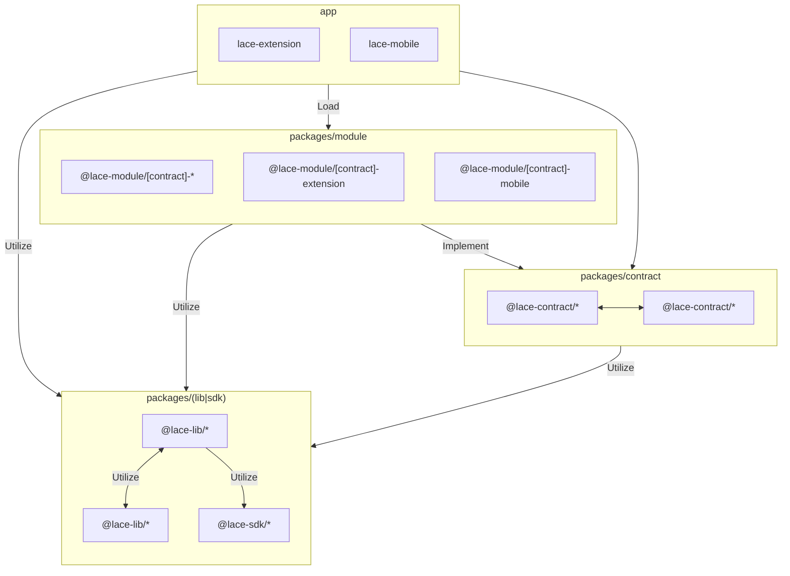

```mermaid
flowchart TB
  subgraph app["app"]
    direction TB
    extension["lace-extension"]
    mobile["lace-mobile"]
  end
  subgraph module["packages/module"]
    direction TB
    contract-module["@lace-module/[contract]-*"]
    extension-module["@lace-module/[contract]-extension"]
    mobile-module["@lace-module/[contract]-mobile"]
  end
  subgraph contract["packages/contract"]
    contract-package["@lace-contract/*"]
    contract-package2["@lace-contract/*"]
  end
  subgraph lib["packages/(lib|sdk)"]
    direction TB
    lib-package2["@lace-lib/*"]
    lib-package["@lace-lib/*"]
    lib-sdk["@lace-sdk/*"]
  end
  app -- Load --> module
  module -- Implement --> contract
  contract-package <--> contract-package2
  app --> contract
  app -- Utilize --> lib
  module -- Utilize --> lib
  contract -- Utilize --> lib
  lib-package -- Utilize --> lib-sdk
  lib-package <-- Utilize --> lib-package2
```
