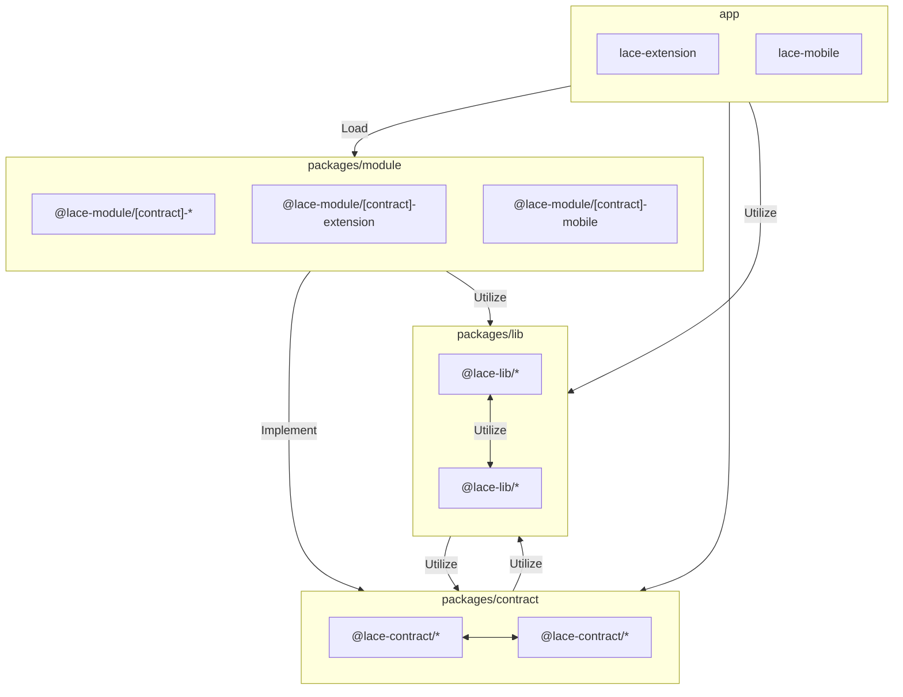

`lib → contract` is an allowed edge: some `@lace-lib/*` packages consume
`@lace-contract/*` types and abstractions (e.g. `ui-toolkit`, `util-hw`,
`util-provider`, `cardano-provider-core`, `bitcoin-provider-core`).

An **app** is the only thing that may reach a module, and it only _loads_ one
(`app -- Load --> module` above). Every other inbound edge is forbidden:
module → module outright ([ADR 14](adr/14-modules-never-import-from-other-modules.md)),
and contract → module / lib → module because they invert the implements
direction — contracts and libs are always loaded, a module only when its
feature flag is on.
