# Contracts and Modules

This document provides an overview of the contract and module architecture in the Lace platform.

## Statistics

- **Total Contracts**: 115
- **Total Modules**: 72

## Contract Clusters

Contracts are automatically grouped based on their dependency relationships:

### Cluster Summary

- **Cardano**: 66 contracts
- **Signer**: 2 contracts
- **Account Standalone**: 3 contracts
- **Misc**: 26 contracts
- **Activities Standalone**: 3 contracts
- **Address Standalone**: 2 contracts
- **Blockchain Standalone**: 2 contracts
- **Bitcoin Standalone**: 2 contracts
- **Feature Standalone**: 2 contracts
- **Onboarding Standalone**: 4 contracts
- **Vault Standalone**: 3 contracts

### Cardano Contracts (Part 1)

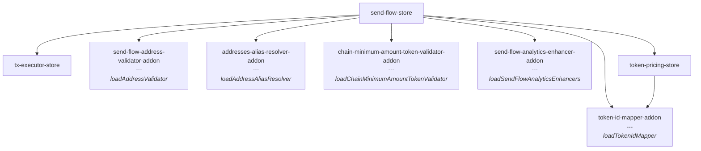
```mermaid
graph TD
  send-flow-store["send-flow-store"]
  tx-executor-store["tx-executor-store"]
  send-flow-address-validator-addon["send-flow-address-validator-addon<br/>---<br/><i>loadAddressValidator</i>"]
  addresses-alias-resolver-addon["addresses-alias-resolver-addon<br/>---<br/><i>loadAddressAliasResolver</i>"]
  chain-minimum-amount-token-validator-addon["chain-minimum-amount-token-validator-addon<br/>---<br/><i>loadChainMinimumAmountTokenValidator</i>"]
  send-flow-analytics-enhancer-addon["send-flow-analytics-enhancer-addon<br/>---<br/><i>loadSendFlowAnalyticsEnhancers</i>"]
  token-pricing-store["token-pricing-store"]
  token-id-mapper-addon["token-id-mapper-addon<br/>---<br/><i>loadTokenIdMapper</i>"]
  send-flow-store --> tx-executor-store
  send-flow-store --> send-flow-address-validator-addon
  send-flow-store --> addresses-alias-resolver-addon
  send-flow-store --> chain-minimum-amount-token-validator-addon
  send-flow-store --> send-flow-analytics-enhancer-addon
  send-flow-store --> token-pricing-store
  send-flow-store --> token-id-mapper-addon
  token-pricing-store --> token-id-mapper-addon
```

### Cardano Contracts (Part 2)

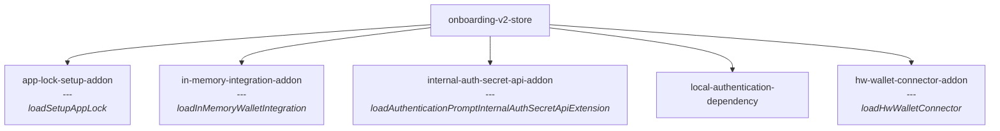
```mermaid
graph TD
  onboarding-v2-store["onboarding-v2-store"]
  app-lock-setup-addon["app-lock-setup-addon<br/>---<br/><i>loadSetupAppLock</i>"]
  in-memory-integration-addon["in-memory-integration-addon<br/>---<br/><i>loadInMemoryWalletIntegration</i>"]
  internal-auth-secret-api-addon["internal-auth-secret-api-addon<br/>---<br/><i>loadAuthenticationPromptInternalAuthSecretApiExtension</i>"]
  local-authentication-dependency["local-authentication-dependency"]
  hw-wallet-connector-addon["hw-wallet-connector-addon<br/>---<br/><i>loadHwWalletConnector</i>"]
  onboarding-v2-store --> app-lock-setup-addon
  onboarding-v2-store --> in-memory-integration-addon
  onboarding-v2-store --> internal-auth-secret-api-addon
  onboarding-v2-store --> local-authentication-dependency
  onboarding-v2-store --> hw-wallet-connector-addon
```

### Cardano Contracts (Part 3)

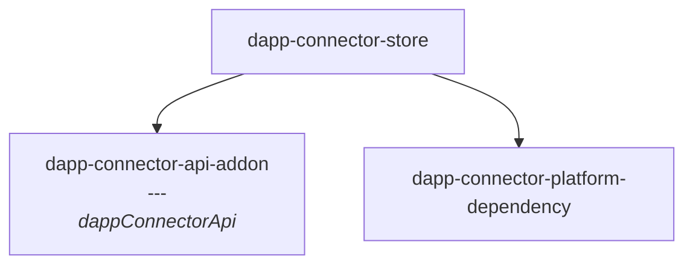
```mermaid
graph TD
  dapp-connector-store["dapp-connector-store"]
  dapp-connector-api-addon["dapp-connector-api-addon<br/>---<br/><i>dappConnectorApi</i>"]
  dapp-connector-platform-dependency["dapp-connector-platform-dependency"]
  dapp-connector-store --> dapp-connector-api-addon
  dapp-connector-store --> dapp-connector-platform-dependency
```

### Cardano Contracts (Part 4)

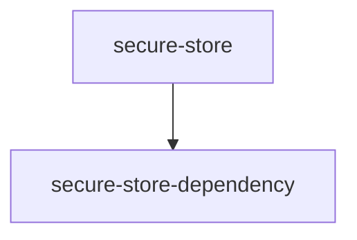
```mermaid
graph TD
  secure-store["secure-store"]
  secure-store-dependency["secure-store-dependency"]
  secure-store --> secure-store-dependency
```

### Signer Contracts and Dependencies

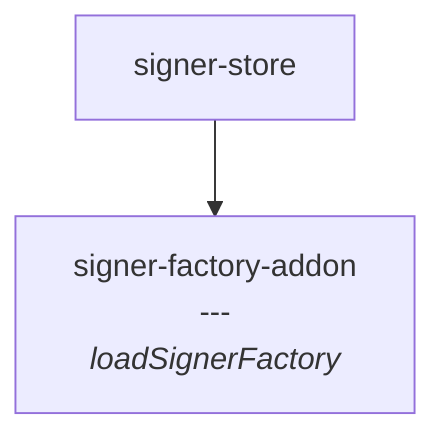
```mermaid
graph TD
  signer-factory-addon["signer-factory-addon<br/>---<br/><i>loadSignerFactory</i>"]
  signer-store["signer-store"]
  signer-store --> signer-factory-addon
```

### Account Standalone Contracts and Dependencies

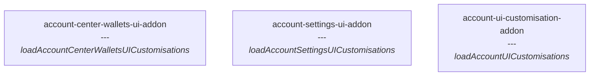
```mermaid
graph TD
  account-center-wallets-ui-addon["account-center-wallets-ui-addon<br/>---<br/><i>loadAccountCenterWalletsUICustomisations</i>"]
  account-settings-ui-addon["account-settings-ui-addon<br/>---<br/><i>loadAccountSettingsUICustomisations</i>"]
  account-ui-customisation-addon["account-ui-customisation-addon<br/>---<br/><i>loadAccountUICustomisations</i>"]
```

### Activities Standalone Contracts and Dependencies

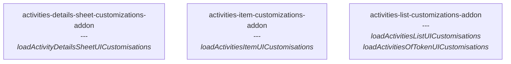
```mermaid
graph TD
  activities-details-sheet-customizations-addon["activities-details-sheet-customizations-addon<br/>---<br/><i>loadActivityDetailsSheetUICustomisations</i>"]
  activities-item-customizations-addon["activities-item-customizations-addon<br/>---<br/><i>loadActivitiesItemUICustomisations</i>"]
  activities-list-customizations-addon["activities-list-customizations-addon<br/>---<br/><i>loadActivitiesListUICustomisations</i><br/><i>loadActivitiesOfTokenUICustomisations</i>"]
```

### Address Standalone Contracts and Dependencies

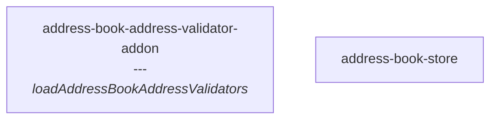
```mermaid
graph TD
  address-book-address-validator-addon["address-book-address-validator-addon<br/>---<br/><i>loadAddressBookAddressValidators</i>"]
  address-book-store["address-book-store"]
```

### Blockchain Standalone Contracts and Dependencies

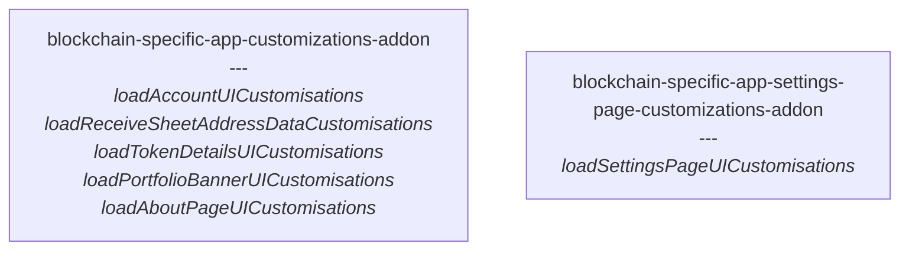
```mermaid
graph TD
  blockchain-specific-app-customizations-addon["blockchain-specific-app-customizations-addon<br/>---<br/><i>loadAccountUICustomisations</i><br/><i>loadReceiveSheetAddressDataCustomisations</i><br/><i>loadTokenDetailsUICustomisations</i><br/><i>loadPortfolioBannerUICustomisations</i><br/><i>loadAboutPageUICustomisations</i>"]
  blockchain-specific-app-settings-page-customizations-addon["blockchain-specific-app-settings-page-customizations-addon<br/>---<br/><i>loadSettingsPageUICustomisations</i>"]
```

### Bitcoin Standalone Contracts and Dependencies

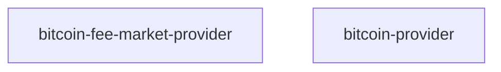
```mermaid
graph TD
  bitcoin-fee-market-provider["bitcoin-fee-market-provider"]
  bitcoin-provider["bitcoin-provider"]
```

### Feature Standalone Contracts and Dependencies

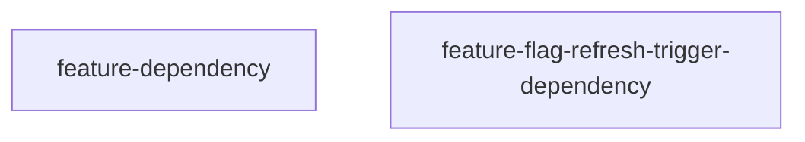
```mermaid
graph TD
  feature-dependency["feature-dependency"]
  feature-flag-refresh-trigger-dependency["feature-flag-refresh-trigger-dependency"]
```

### Onboarding Standalone Contracts and Dependencies

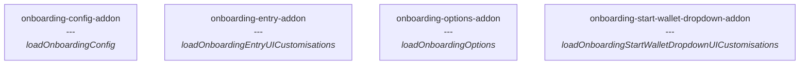
```mermaid
graph TD
  onboarding-config-addon["onboarding-config-addon<br/>---<br/><i>loadOnboardingConfig</i>"]
  onboarding-entry-addon["onboarding-entry-addon<br/>---<br/><i>loadOnboardingEntryUICustomisations</i>"]
  onboarding-options-addon["onboarding-options-addon<br/>---<br/><i>loadOnboardingOptions</i>"]
  onboarding-start-wallet-dropdown-addon["onboarding-start-wallet-dropdown-addon<br/>---<br/><i>loadOnboardingStartWalletDropdownUICustomisations</i>"]
```

### Vault Standalone Contracts and Dependencies

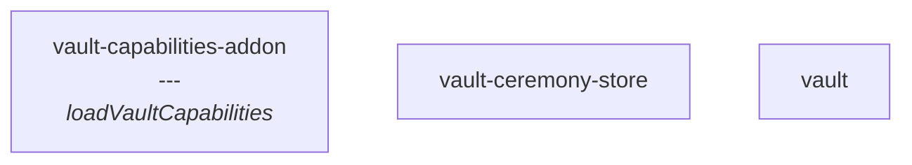
```mermaid
graph TD
  vault-capabilities-addon["vault-capabilities-addon<br/>---<br/><i>loadVaultCapabilities</i>"]
  vault-ceremony-store["vault-ceremony-store"]
  vault["vault"]
```

## Module Implementations

The following diagrams show which modules implement which contracts:

### Sheet Pages Addon Related Module Implementations

```mermaid
graph LR
  subgraph Contracts
    stack-pages-addon["stack-pages-addon<br/>---<br/><i>loadStackPages</i>"]
    tab-pages-addon["tab-pages-addon<br/>---<br/><i>loadTabPages</i>"]
    account-management-store["account-management-store"]
    sheet-pages-addon["sheet-pages-addon<br/>---<br/><i>loadSheetPages</i>"]
    dapp-connector-api-addon["dapp-connector-api-addon<br/>---<br/><i>dappConnectorApi</i>"]
    render-root-addon["render-root-addon<br/>---<br/><i>renderRoot</i>"]
    account-settings-ui-addon["account-settings-ui-addon<br/>---<br/><i>loadAccountSettingsUICustomisations</i>"]
    activities-details-sheet-customizations-addon["activities-details-sheet-customizations-addon<br/>---<br/><i>loadActivityDetailsSheetUICustomisations</i>"]
    global-overlays-addon["global-overlays-addon<br/>---<br/><i>loadGlobalOverlays</i>"]
    air-gapped-qr-exchange-store["air-gapped-qr-exchange-store"]
    authentication-prompt-store["authentication-prompt-store"]
    auth-prompt-ui-component-addon["auth-prompt-ui-component-addon<br/>---<br/><i>loadRenderAuthPromptUI</i>"]
    internal-auth-secret-api-addon["internal-auth-secret-api-addon<br/>---<br/><i>loadAuthenticationPromptInternalAuthSecretApiExtension</i>"]
    blockchain-specific-app-settings-page-customizations-addon["blockchain-specific-app-settings-page-customizations-addon<br/>---<br/><i>loadSettingsPageUICustomisations</i>"]
    onboarding-entry-addon["onboarding-entry-addon<br/>---<br/><i>loadOnboardingEntryUICustomisations</i>"]
    wallet-settings-ui-customisation-addon["wallet-settings-ui-customisation-addon<br/>---<br/><i>loadWalletSettingsUICustomisations</i>"]
    dapp-connector-platform-dependency["dapp-connector-platform-dependency"]
    load-deep-links-addon["load-deep-links-addon<br/>---<br/><i>loadMobileDeepLinks</i>"]
    dialogs-addon["dialogs-addon<br/>---<br/><i>loadDialogs</i>"]
    initialize-extension-view-addon["initialize-extension-view-addon<br/>---<br/><i>loadInitializeExtensionView</i>"]
    initialize-mobile-view-addon["initialize-mobile-view-addon<br/>---<br/><i>loadInitializeMobileView</i>"]
    swap-context-store["swap-context-store"]
    views-store["views-store"]
    app-lock-setup-addon["app-lock-setup-addon<br/>---<br/><i>loadSetupAppLock</i>"]
    app-lock-store["app-lock-store"]
    auth-secret-verifier-addon["auth-secret-verifier-addon<br/>---<br/><i>loadAuthSecretVerifier</i>"]
    wallet-active-state-dependency["wallet-active-state-dependency"]
    dev["dev"]
    feature-store["feature-store"]
    feature-dependency["feature-dependency"]
    notification-center-store["notification-center-store"]
    onboarding-v2-store["onboarding-v2-store"]
    vault-ceremony-store["vault-ceremony-store"]
    vault-capabilities-addon["vault-capabilities-addon<br/>---<br/><i>loadVaultCapabilities</i>"]
    earn-rewards-store["earn-rewards-store"]
    portfolio-announcements-addon["portfolio-announcements-addon<br/>---<br/><i>loadPortfolioAnnouncements</i>"]
    recovery-phrase-store["recovery-phrase-store"]
  end
  subgraph Modules
    module_0["account-management"]
    module_1["address-book"]
    module_2["dapp-connector-bitcoin"]
    module_3["dapp-connector-midnight"]
    module_4["send-flow"]
    module_5["blockchain-cardano-ui"]
    module_6["blockchain-bitcoin-ui"]
    module_7["migrate-multi-delegation"]
    module_8["air-gapped-qr-exchange-host"]
    module_9["migrate-v1-data"]
    module_10["authentication-prompt-ui-v2-extension"]
    module_11["migrate-wallet"]
    module_12["dapp-connector-cardano"]
    module_13["cardano-uri-linking"]
    module_14["identity-center"]
    module_15["dapp-explorer"]
    module_16["governance-center"]
    module_17["staking-center"]
    module_18["swap-center"]
    module_19["views-extension"]
    module_20["app-lock"]
    module_21["views-mobile"]
    module_22["test-api"]
    module_23["feature-dev"]
    module_24["feature-posthog"]
    module_25["notification-center"]
    module_26["onboarding"]
    module_27["vault-local"]
    module_28["vault-extension-host"]
    module_29["dapp-connector-extension"]
    module_30["earn-rewards"]
    module_31["vault-in-memory-ui"]
  end
  module_0 -.->|implements| stack-pages-addon
  module_0 -.->|implements| tab-pages-addon
  module_0 -.->|implements| account-management-store
  module_0 -.->|implements| sheet-pages-addon
  module_1 -.->|implements| tab-pages-addon
  module_1 -.->|implements| sheet-pages-addon
  module_2 -.->|implements| dapp-connector-api-addon
  module_2 -.->|implements| render-root-addon
  module_2 -.->|implements| sheet-pages-addon
  module_3 -.->|implements| dapp-connector-api-addon
  module_3 -.->|implements| render-root-addon
  module_4 -.->|implements| sheet-pages-addon
  module_5 -.->|implements| account-settings-ui-addon
  module_5 -.->|implements| activities-details-sheet-customizations-addon
  module_5 -.->|implements| global-overlays-addon
  module_5 -.->|implements| sheet-pages-addon
  module_6 -.->|implements| account-settings-ui-addon
  module_7 -.->|implements| global-overlays-addon
  module_8 -.->|implements| global-overlays-addon
  module_8 -.->|implements| air-gapped-qr-exchange-store
  module_9 -.->|implements| global-overlays-addon
  module_10 -.->|implements| authentication-prompt-store
  module_10 -.->|implements| auth-prompt-ui-component-addon
  module_10 -.->|implements| global-overlays-addon
  module_10 -.->|implements| internal-auth-secret-api-addon
  module_11 -.->|implements| blockchain-specific-app-settings-page-customizations-addon
  module_11 -.->|implements| global-overlays-addon
  module_11 -.->|implements| onboarding-entry-addon
  module_11 -.->|implements| wallet-settings-ui-customisation-addon
  module_12 -.->|implements| dapp-connector-platform-dependency
  module_12 -.->|implements| sheet-pages-addon
  module_12 -.->|implements| stack-pages-addon
  module_13 -.->|implements| stack-pages-addon
  module_13 -.->|implements| load-deep-links-addon
  module_14 -.->|implements| stack-pages-addon
  module_14 -.->|implements| tab-pages-addon
  module_14 -.->|implements| sheet-pages-addon
  module_15 -.->|implements| tab-pages-addon
  module_15 -.->|implements| sheet-pages-addon
  module_15 -.->|implements| dialogs-addon
  module_16 -.->|implements| tab-pages-addon
  module_16 -.->|implements| sheet-pages-addon
  module_16 -.->|implements| initialize-extension-view-addon
  module_16 -.->|implements| initialize-mobile-view-addon
  module_17 -.->|implements| tab-pages-addon
  module_17 -.->|implements| sheet-pages-addon
  module_17 -.->|implements| initialize-extension-view-addon
  module_17 -.->|implements| initialize-mobile-view-addon
  module_18 -.->|implements| tab-pages-addon
  module_18 -.->|implements| sheet-pages-addon
  module_18 -.->|implements| swap-context-store
  module_18 -.->|implements| dialogs-addon
  module_18 -.->|implements| blockchain-specific-app-settings-page-customizations-addon
  module_19 -.->|implements| views-store
  module_19 -.->|implements| initialize-extension-view-addon
  module_19 -.->|implements| sheet-pages-addon
  module_19 -.->|implements| blockchain-specific-app-settings-page-customizations-addon
  module_20 -.->|implements| app-lock-setup-addon
  module_20 -.->|implements| app-lock-store
  module_20 -.->|implements| auth-secret-verifier-addon
  module_20 -.->|implements| sheet-pages-addon
  module_20 -.->|implements| blockchain-specific-app-settings-page-customizations-addon
  module_20 -.->|implements| wallet-active-state-dependency
  module_21 -.->|implements| views-store
  module_22 -.->|implements| dev
  module_22 -.->|implements| initialize-extension-view-addon
  module_22 -.->|implements| initialize-mobile-view-addon
  module_23 -.->|implements| feature-store
  module_23 -.->|implements| feature-dependency
  module_23 -.->|implements| dev
  module_23 -.->|implements| initialize-extension-view-addon
  module_24 -.->|implements| feature-store
  module_24 -.->|implements| feature-dependency
  module_25 -.->|implements| notification-center-store
  module_25 -.->|implements| stack-pages-addon
  module_25 -.->|implements| tab-pages-addon
  module_26 -.->|implements| onboarding-v2-store
  module_26 -.->|implements| stack-pages-addon
  module_27 -.->|implements| vault-ceremony-store
  module_27 -.->|implements| vault-capabilities-addon
  module_27 -.->|implements| stack-pages-addon
  module_27 -.->|implements| sheet-pages-addon
  module_28 -.->|implements| vault-ceremony-store
  module_28 -.->|implements| vault-capabilities-addon
  module_28 -.->|implements| wallet-settings-ui-customisation-addon
  module_29 -.->|implements| dapp-connector-platform-dependency
  module_30 -.->|implements| earn-rewards-store
  module_30 -.->|implements| sheet-pages-addon
  module_30 -.->|implements| portfolio-announcements-addon
  module_31 -.->|implements| wallet-settings-ui-customisation-addon
  module_31 -.->|implements| recovery-phrase-store
  module_31 -.->|implements| sheet-pages-addon
```

### Ada Module Implementations

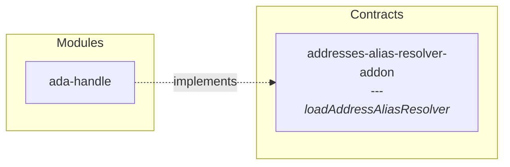
```mermaid
graph LR
  subgraph Contracts
    addresses-alias-resolver-addon["addresses-alias-resolver-addon<br/>---<br/><i>loadAddressAliasResolver</i>"]
  end
  subgraph Modules
    module_0["ada-handle"]
  end
  module_0 -.->|implements| addresses-alias-resolver-addon
```

### Analytics Module Implementations

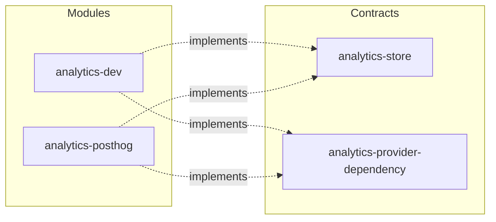
```mermaid
graph LR
  subgraph Contracts
    analytics-store["analytics-store"]
    analytics-provider-dependency["analytics-provider-dependency"]
  end
  subgraph Modules
    module_0["analytics-dev"]
    module_1["analytics-posthog"]
  end
  module_0 -.->|implements| analytics-store
  module_0 -.->|implements| analytics-provider-dependency
  module_1 -.->|implements| analytics-store
  module_1 -.->|implements| analytics-provider-dependency
```

### App Activity Module Implementations

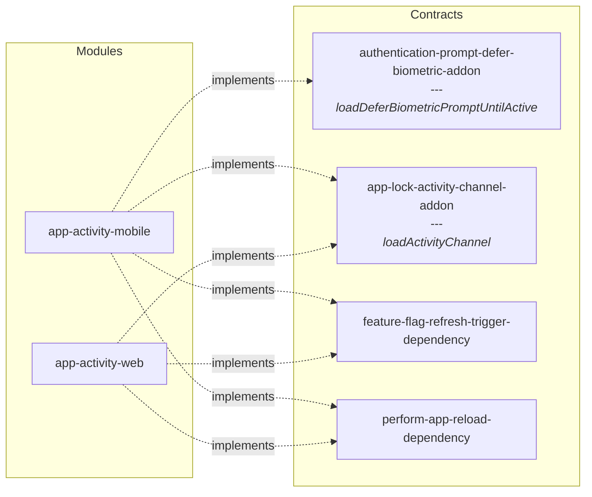
```mermaid
graph LR
  subgraph Contracts
    authentication-prompt-defer-biometric-addon["authentication-prompt-defer-biometric-addon<br/>---<br/><i>loadDeferBiometricPromptUntilActive</i>"]
    app-lock-activity-channel-addon["app-lock-activity-channel-addon<br/>---<br/><i>loadActivityChannel</i>"]
    feature-flag-refresh-trigger-dependency["feature-flag-refresh-trigger-dependency"]
    perform-app-reload-dependency["perform-app-reload-dependency"]
  end
  subgraph Modules
    module_0["app-activity-mobile"]
    module_1["app-activity-web"]
  end
  module_0 -.->|implements| authentication-prompt-defer-biometric-addon
  module_0 -.->|implements| app-lock-activity-channel-addon
  module_0 -.->|implements| feature-flag-refresh-trigger-dependency
  module_0 -.->|implements| perform-app-reload-dependency
  module_1 -.->|implements| app-lock-activity-channel-addon
  module_1 -.->|implements| feature-flag-refresh-trigger-dependency
  module_1 -.->|implements| perform-app-reload-dependency
```

### App Module Implementations

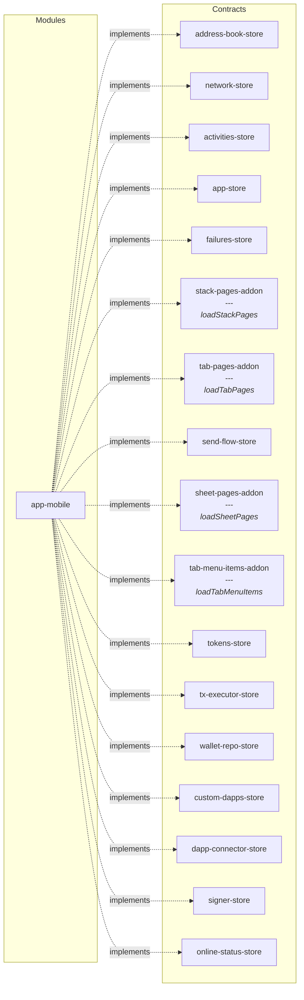
```mermaid
graph LR
  subgraph Contracts
    address-book-store["address-book-store"]
    network-store["network-store"]
    activities-store["activities-store"]
    app-store["app-store"]
    failures-store["failures-store"]
    stack-pages-addon["stack-pages-addon<br/>---<br/><i>loadStackPages</i>"]
    tab-pages-addon["tab-pages-addon<br/>---<br/><i>loadTabPages</i>"]
    send-flow-store["send-flow-store"]
    sheet-pages-addon["sheet-pages-addon<br/>---<br/><i>loadSheetPages</i>"]
    tab-menu-items-addon["tab-menu-items-addon<br/>---<br/><i>loadTabMenuItems</i>"]
    tokens-store["tokens-store"]
    tx-executor-store["tx-executor-store"]
    wallet-repo-store["wallet-repo-store"]
    custom-dapps-store["custom-dapps-store"]
    dapp-connector-store["dapp-connector-store"]
    signer-store["signer-store"]
    online-status-store["online-status-store"]
  end
  subgraph Modules
    module_0["app-mobile"]
  end
  module_0 -.->|implements| address-book-store
  module_0 -.->|implements| network-store
  module_0 -.->|implements| activities-store
  module_0 -.->|implements| app-store
  module_0 -.->|implements| failures-store
  module_0 -.->|implements| stack-pages-addon
  module_0 -.->|implements| tab-pages-addon
  module_0 -.->|implements| send-flow-store
  module_0 -.->|implements| sheet-pages-addon
  module_0 -.->|implements| tab-menu-items-addon
  module_0 -.->|implements| tokens-store
  module_0 -.->|implements| tx-executor-store
  module_0 -.->|implements| wallet-repo-store
  module_0 -.->|implements| custom-dapps-store
  module_0 -.->|implements| dapp-connector-store
  module_0 -.->|implements| signer-store
  module_0 -.->|implements| online-status-store
```

### Bitcoin Provider Related Module Implementations

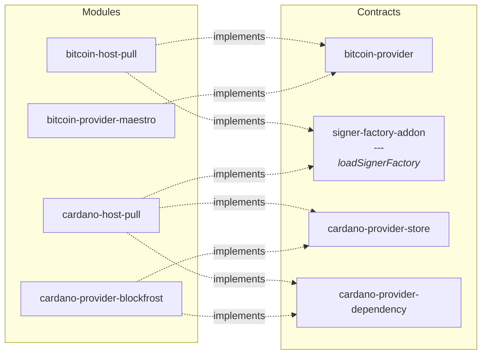
```mermaid
graph LR
  subgraph Contracts
    bitcoin-provider["bitcoin-provider"]
    signer-factory-addon["signer-factory-addon<br/>---<br/><i>loadSignerFactory</i>"]
    cardano-provider-store["cardano-provider-store"]
    cardano-provider-dependency["cardano-provider-dependency"]
  end
  subgraph Modules
    module_0["bitcoin-host-pull"]
    module_1["bitcoin-provider-maestro"]
    module_2["cardano-host-pull"]
    module_3["cardano-provider-blockfrost"]
  end
  module_0 -.->|implements| bitcoin-provider
  module_0 -.->|implements| signer-factory-addon
  module_1 -.->|implements| bitcoin-provider
  module_2 -.->|implements| cardano-provider-store
  module_2 -.->|implements| cardano-provider-dependency
  module_2 -.->|implements| signer-factory-addon
  module_3 -.->|implements| cardano-provider-store
  module_3 -.->|implements| cardano-provider-dependency
```

### Bitcoin Module Implementations

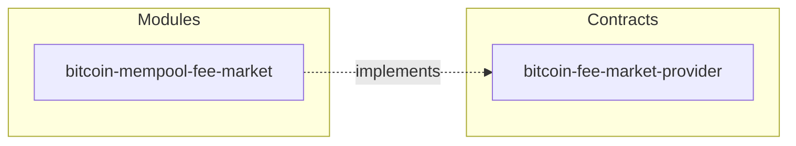
```mermaid
graph LR
  subgraph Contracts
    bitcoin-fee-market-provider["bitcoin-fee-market-provider"]
  end
  subgraph Modules
    module_0["bitcoin-mempool-fee-market"]
  end
  module_0 -.->|implements| bitcoin-fee-market-provider
```

### Tokens Store Related Module Implementations

```mermaid
graph LR
  subgraph Contracts
    in-memory-integration-addon["in-memory-integration-addon<br/>---<br/><i>loadInMemoryWalletIntegration</i>"]
    account-ui-customisation-addon["account-ui-customisation-addon<br/>---<br/><i>loadAccountUICustomisations</i>"]
    send-flow-sheet-ui-customisation-addon["send-flow-sheet-ui-customisation-addon<br/>---<br/><i>loadSendFlowSheetUICustomisations</i>"]
    tokens-store["tokens-store"]
    addresses-store["addresses-store"]
    sync-store["sync-store"]
    activities-item-customizations-addon["activities-item-customizations-addon<br/>---<br/><i>loadActivitiesItemUICustomisations</i>"]
    tx-executor-implementation-addon["tx-executor-implementation-addon<br/>---<br/><i>loadTxExecutorImplementation</i>"]
    send-flow-address-validator-addon["send-flow-address-validator-addon<br/>---<br/><i>loadAddressValidator</i>"]
    base-token-addon["base-token-addon<br/>---<br/><i>loadBaseToken</i>"]
    chain-minimum-amount-token-validator-addon["chain-minimum-amount-token-validator-addon<br/>---<br/><i>loadChainMinimumAmountTokenValidator</i>"]
    address-book-address-validator-addon["address-book-address-validator-addon<br/>---<br/><i>loadAddressBookAddressValidators</i>"]
    token-id-mapper-addon["token-id-mapper-addon<br/>---<br/><i>loadTokenIdMapper</i>"]
    signer-factory-addon["signer-factory-addon<br/>---<br/><i>loadSignerFactory</i>"]
    delegation-tx-builder-addon["delegation-tx-builder-addon<br/>---<br/><i>loadDelegationTxBuilder</i>"]
    cardano-in-memory-signing-dependency["cardano-in-memory-signing-dependency"]
    deregistration-tx-builder-addon["deregistration-tx-builder-addon<br/>---<br/><i>loadDeregistrationTxBuilder</i>"]
    staking-center-store["staking-center-store"]
    governance-center-store["governance-center-store"]
    vote-delegation-tx-builder-addon["vote-delegation-tx-builder-addon<br/>---<br/><i>loadVoteDelegationTxBuilder</i>"]
    earn-rewards-tx-builder-addon["earn-rewards-tx-builder-addon<br/>---<br/><i>loadEarnRewardsTxBuilder</i>"]
    wallet-identity-addon["wallet-identity-addon<br/>---<br/><i>loadWalletIdentity</i>"]
    midnight-dependency["midnight-dependency"]
    account-settings-ui-addon["account-settings-ui-addon<br/>---<br/><i>loadAccountSettingsUICustomisations</i>"]
    midnight-context-store["midnight-context-store"]
    blockchain-specific-app-customizations-addon["blockchain-specific-app-customizations-addon<br/>---<br/><i>loadAccountUICustomisations</i><br/><i>loadReceiveSheetAddressDataCustomisations</i><br/><i>loadTokenDetailsUICustomisations</i><br/><i>loadPortfolioBannerUICustomisations</i><br/><i>loadAboutPageUICustomisations</i>"]
    blockchain-specific-app-settings-page-customizations-addon["blockchain-specific-app-settings-page-customizations-addon<br/>---<br/><i>loadSettingsPageUICustomisations</i>"]
    activities-details-sheet-customizations-addon["activities-details-sheet-customizations-addon<br/>---<br/><i>loadActivityDetailsSheetUICustomisations</i>"]
    send-flow-analytics-enhancer-addon["send-flow-analytics-enhancer-addon<br/>---<br/><i>loadSendFlowAnalyticsEnhancers</i>"]
    sheet-pages-addon["sheet-pages-addon<br/>---<br/><i>loadSheetPages</i>"]
    dialogs-addon["dialogs-addon<br/>---<br/><i>loadDialogs</i>"]
  end
  subgraph Modules
    module_0["blockchain-bitcoin"]
    module_1["blockchain-cardano"]
    module_2["midnight-sync"]
    module_3["midnight-host-pull"]
    module_4["blockchain-midnight"]
  end
  module_0 -.->|implements| in-memory-integration-addon
  module_0 -.->|implements| account-ui-customisation-addon
  module_0 -.->|implements| send-flow-sheet-ui-customisation-addon
  module_0 -.->|implements| tokens-store
  module_0 -.->|implements| addresses-store
  module_0 -.->|implements| sync-store
  module_0 -.->|implements| activities-item-customizations-addon
  module_0 -.->|implements| tx-executor-implementation-addon
  module_0 -.->|implements| send-flow-address-validator-addon
  module_0 -.->|implements| base-token-addon
  module_0 -.->|implements| chain-minimum-amount-token-validator-addon
  module_0 -.->|implements| address-book-address-validator-addon
  module_0 -.->|implements| token-id-mapper-addon
  module_0 -.->|implements| signer-factory-addon
  module_1 -.->|implements| in-memory-integration-addon
  module_1 -.->|implements| account-ui-customisation-addon
  module_1 -.->|implements| send-flow-sheet-ui-customisation-addon
  module_1 -.->|implements| tokens-store
  module_1 -.->|implements| addresses-store
  module_1 -.->|implements| signer-factory-addon
  module_1 -.->|implements| send-flow-address-validator-addon
  module_1 -.->|implements| tx-executor-implementation-addon
  module_1 -.->|implements| activities-item-customizations-addon
  module_1 -.->|implements| sync-store
  module_1 -.->|implements| base-token-addon
  module_1 -.->|implements| chain-minimum-amount-token-validator-addon
  module_1 -.->|implements| address-book-address-validator-addon
  module_1 -.->|implements| delegation-tx-builder-addon
  module_1 -.->|implements| cardano-in-memory-signing-dependency
  module_1 -.->|implements| token-id-mapper-addon
  module_1 -.->|implements| deregistration-tx-builder-addon
  module_1 -.->|implements| staking-center-store
  module_1 -.->|implements| governance-center-store
  module_1 -.->|implements| vote-delegation-tx-builder-addon
  module_1 -.->|implements| earn-rewards-tx-builder-addon
  module_1 -.->|implements| wallet-identity-addon
  module_2 -.->|implements| in-memory-integration-addon
  module_2 -.->|implements| tokens-store
  module_2 -.->|implements| sync-store
  module_2 -.->|implements| addresses-store
  module_2 -.->|implements| midnight-dependency
  module_2 -.->|implements| tx-executor-implementation-addon
  module_2 -.->|implements| signer-factory-addon
  module_3 -.->|implements| midnight-dependency
  module_3 -.->|implements| tx-executor-implementation-addon
  module_4 -.->|implements| account-settings-ui-addon
  module_4 -.->|implements| tokens-store
  module_4 -.->|implements| addresses-store
  module_4 -.->|implements| midnight-context-store
  module_4 -.->|implements| blockchain-specific-app-customizations-addon
  module_4 -.->|implements| blockchain-specific-app-settings-page-customizations-addon
  module_4 -.->|implements| send-flow-sheet-ui-customisation-addon
  module_4 -.->|implements| activities-details-sheet-customizations-addon
  module_4 -.->|implements| send-flow-address-validator-addon
  module_4 -.->|implements| base-token-addon
  module_4 -.->|implements| send-flow-analytics-enhancer-addon
  module_4 -.->|implements| address-book-address-validator-addon
  module_4 -.->|implements| sheet-pages-addon
  module_4 -.->|implements| dialogs-addon
```

### Crypto Module Implementations

```mermaid
graph LR
  subgraph Contracts
    crypto-addon["crypto-addon<br/>---<br/><i>bip32Ed25519</i><br/><i>blake2b</i>"]
  end
  subgraph Modules
    module_0["crypto-apollo"]
    module_1["crypto-cardano-sdk"]
  end
  module_0 -.->|implements| crypto-addon
  module_1 -.->|implements| crypto-addon
```

### Hw Module Implementations

```mermaid
graph LR
  subgraph Contracts
    request-hw-connection-addon["request-hw-connection-addon<br/>---<br/><i>loadRequestHWConnections</i>"]
  end
  subgraph Modules
    module_0["hw-connector"]
  end
  module_0 -.->|implements| request-hw-connection-addon
```

### I18n Module Implementations

```mermaid
graph LR
  subgraph Contracts
    i18n-dependency["i18n-dependency"]
    app-context-initialization-addon["app-context-initialization-addon<br/>---<br/><i>loadInitializeAppContext</i>"]
    initialize-extension-view-addon["initialize-extension-view-addon<br/>---<br/><i>loadInitializeExtensionView</i>"]
  end
  subgraph Modules
    module_0["i18n"]
  end
  module_0 -.->|implements| i18n-dependency
  module_0 -.->|implements| app-context-initialization-addon
  module_0 -.->|implements| initialize-extension-view-addon
```

### Posthog Client Module Implementations

```mermaid
graph LR
  subgraph Contracts
    posthog-dependency["posthog-dependency"]
  end
  subgraph Modules
    module_0["posthog-client-extension"]
    module_1["posthog-client-react-native"]
  end
  module_0 -.->|implements| posthog-dependency
  module_1 -.->|implements| posthog-dependency
```

### Recovery Module Implementations

```mermaid
graph LR
  subgraph Contracts
    recovery-phrase-channel-extension["recovery-phrase-channel-extension<br/>---<br/><i>loadRecoveryPhraseChannelExtension</i>"]
  end
  subgraph Modules
    module_0["recovery-phrase-channel-extension"]
  end
  module_0 -.->|implements| recovery-phrase-channel-extension
```

### Secure Store Module Implementations

```mermaid
graph LR
  subgraph Contracts
    secure-store["secure-store"]
    secure-store-addon["secure-store-addon<br/>---<br/><i>loadSecureStore</i>"]
    secure-store-dependency["secure-store-dependency"]
    local-authentication-dependency["local-authentication-dependency"]
  end
  subgraph Modules
    module_0["secure-store-extension"]
    module_1["secure-store-mobile"]
  end
  module_0 -.->|implements| secure-store
  module_0 -.->|implements| secure-store-addon
  module_0 -.->|implements| secure-store-dependency
  module_0 -.->|implements| local-authentication-dependency
  module_1 -.->|implements| secure-store
  module_1 -.->|implements| secure-store-addon
  module_1 -.->|implements| secure-store-dependency
  module_1 -.->|implements| local-authentication-dependency
```

### Storage Module Implementations

```mermaid
graph LR
  subgraph Contracts
    storage-dependency["storage-dependency"]
  end
  subgraph Modules
    module_0["storage-extension"]
    module_1["storage-in-memory"]
    module_2["storage-react-native-async"]
    module_3["storage-web-indexeddb"]
  end
  module_0 -.->|implements| storage-dependency
  module_1 -.->|implements| storage-dependency
  module_2 -.->|implements| storage-dependency
  module_3 -.->|implements| storage-dependency
```

### Swap Module Implementations

```mermaid
graph LR
  subgraph Contracts
    swap-provider-dependency["swap-provider-dependency"]
  end
  subgraph Modules
    module_0["swap-provider-steelswap"]
  end
  module_0 -.->|implements| swap-provider-dependency
```

### Token Module Implementations

```mermaid
graph LR
  subgraph Contracts
    token-pricing-store["token-pricing-store"]
    token-pricing-provider-dependency["token-pricing-provider-dependency"]
  end
  subgraph Modules
    module_0["token-pricing-coingecko"]
  end
  module_0 -.->|implements| token-pricing-store
  module_0 -.->|implements| token-pricing-provider-dependency
```

### Vault Module Implementations

```mermaid
graph LR
  subgraph Contracts
    vault["vault"]
  end
  subgraph Modules
    module_0["vault-in-memory"]
  end
  module_0 -.->|implements| vault
```

### Vault (1) Module Implementations

```mermaid
graph LR
  subgraph Contracts
    onboarding-options-addon["onboarding-options-addon<br/>---<br/><i>loadOnboardingOptions</i>"]
    signer-factory-addon["signer-factory-addon<br/>---<br/><i>loadSignerFactory</i>"]
    hw-wallet-connector-addon["hw-wallet-connector-addon<br/>---<br/><i>loadHwWalletConnector</i>"]
    hw-blockchain-support-addon["hw-blockchain-support-addon<br/>---<br/><i>loadHwBlockchainSupport</i>"]
    ledger-hw-account-connector-addon["ledger-hw-account-connector-addon<br/>---<br/><i>loadLedgerHwAccountConnector</i>"]
    vault["vault"]
    trezor-hw-account-connector-addon["trezor-hw-account-connector-addon<br/>---<br/><i>loadTrezorHwAccountConnector</i>"]
  end
  subgraph Modules
    module_0["vault-keystone"]
    module_1["vault-ledger"]
    module_2["vault-seed-signer"]
    module_3["vault-trezor"]
  end
  module_0 -.->|implements| onboarding-options-addon
  module_0 -.->|implements| signer-factory-addon
  module_0 -.->|implements| hw-wallet-connector-addon
  module_0 -.->|implements| hw-blockchain-support-addon
  module_1 -.->|implements| onboarding-options-addon
  module_1 -.->|implements| signer-factory-addon
  module_1 -.->|implements| hw-wallet-connector-addon
  module_1 -.->|implements| hw-blockchain-support-addon
  module_1 -.->|implements| ledger-hw-account-connector-addon
  module_2 -.->|implements| onboarding-options-addon
  module_2 -.->|implements| signer-factory-addon
  module_2 -.->|implements| hw-wallet-connector-addon
  module_2 -.->|implements| hw-blockchain-support-addon
  module_3 -.->|implements| vault
  module_3 -.->|implements| onboarding-options-addon
  module_3 -.->|implements| signer-factory-addon
  module_3 -.->|implements| hw-wallet-connector-addon
  module_3 -.->|implements| hw-blockchain-support-addon
  module_3 -.->|implements| trezor-hw-account-connector-addon
```
