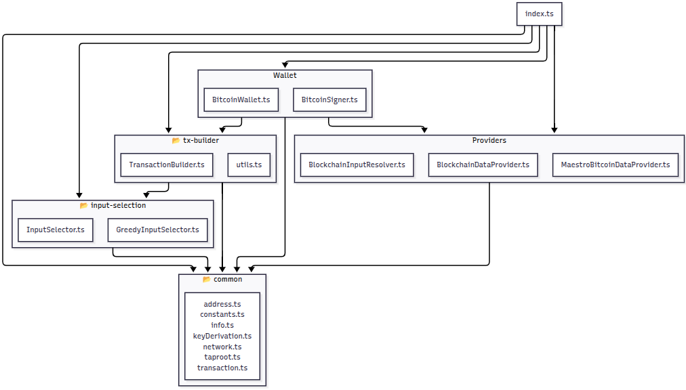

# **Bitcoin Observable Wallet**

A lightweight TypeScript SDK that turns a set of HD keys into a fully-functional, observable Bitcoin wallet.

It exposes RxJS streams (balance$, utxos$, transactionHistory$) so front-ends can react to on-chain changes in real time, it provides several extension points to fetch blocks, UTXOs and fees, coin-selection, PSBT construction, and Secp256k1 signing. Currently the package comes with default implementation for these interfaces using Maestro Bitcoin API (https://www.gomaestro.org/) for data fetching and @bitcoinerlab/secp256k1, coinselect and bitcoinjs-lib for transaction serialization and signing.

---

## **Modules**

The package is organized in 5 modules:

  

### **Modules Description**

| Module                                    | Purpose                                                                                          |
| ----------------------------------------- | ------------------------------------------------------------------------------------------------ |
| **common/**                               | Pure, stateless helpers that can be reused by every other module. No network or side-effects.    |
| `common/address.ts`                       | Convert compressed pubkeys to P2PKH, P2SH-P2WPKH, P2WPKH and P2TR addresses; validate addresses. |
| `common/constants.ts`                     | Shared byte-sizes (input/output/overhead), dust threshold, etc.                                  |
| `common/info.ts`                          | Type that groups the five account-level XPUBs produced for each address type.                    |
| `common/keyDerivation.ts`                 | BIP-39/BIP-32/Electrum seed derivation, account & child key derivation, Taproot tweaks.          |
| `common/network.ts`                       | Enum for Mainnet / Testnet and related helpers.                                                  |
| `common/taproot.ts`                       | Low-level functions to compute BIP-341 tagged hashes and tweak x-only pub/priv keys.             |
| `common/transaction.ts`                   | UnsignedTransaction / SignedTransaction type definitions.                                        |
| **input-selection/**                      | Pluggable coin-selection strategies.                                                             |
| `input-selection/InputSelector.ts`        | Interface describing the contract for any selector implementation.                               |
| `input-selection/GreedyInputSelector.ts`  | Deterministic greedy algorithm that selects largest UTXOs until target + fee is met.             |
| **providers/**                            | Abstract access to the Bitcoin network and on-chain data.                                        |
| `providers/BlockchainDataProvider.ts`     | Interface for reading chain state, mempool, fee rates, and broadcasting TXs.                     |
| `providers/MaestroBitcoinDataProvider.ts` | Concrete HTTP client against Maestro’s REST API.                                                 |
| `providers/StubBitcoinDataProvider.ts`    | In-memory mock that returns deterministic data for unit tests.                                   |
| `providers/BlockchainInputResolver.ts`    | Helper that maps a (txid, vout) pair to a full UTxO by calling the provider.                     |
| **tx-builder/**                           | Everything needed to construct a PSBT ready for signing.                                         |
| `tx-builder/TransactionBuilder.ts`        | Accepts outputs, change address, selector, builds PSBT, estimates vBytes & fee.                  |
| `tx-builder/utils.ts`                     | Constants & helpers specific to size/fee calculation inside the builder.                         |
| **wallet/**                               | Stateful, observable wallet core and signer.                                                     |
| `wallet/BitcoinWallet.ts`                 | Polls provider, maintains `balance$`, `utxos$`, history & pending TXs via RxJS.                  |
| `wallet/BitcoinSigner.ts`                 | Thin wrapper around `@bitcoinerlab/secp256k1` for PSBT input signing + key zeroisation.          |
| `index.ts`                                | Package entry point.                                                                             |

## **High Level Overview**

### Common

Handles all deterministic key derivation (BIP-32, Electrum), address transformation, and Taproot tweaking. It is strictly pure code with no network or disk I/O. It contains some common types shared across all other modules.

### Provider

A thin abstraction (BlockchainDataProvider) encodes everything the wallet needs from a chain service: block tip, UTXOs, mempool, fee estimates, and broadcast. The provider isolates all network I/O and normalises raw REST/RPC responses into the package’s own types (BlockInfo, UTxO, TransactionHistoryEntry, …).
This module also provides an interface and a concrete implementation of BlockchainInputResolver used only by the transaction-analysis utilities (e.g. turning a raw hex TX into a TransactionHistoryEntry).

### Wallet State

BitcoinWallet orchestrates polling and state aggregation. It owns a set of RxJS Subjects (utxos$, balance$, transactionHistory$, pendingTransactions$) that higher layers subscribe to.

A poll controller observable allows host applications (e.g. browser tab visibility) to dynamically pause/resume network activity without tearing down the wallet instance.

Each Subject’s latest value is replayed to new subscribers, so consumers see a consistent view even if they attach late.

This wallet function is purely to track wallet state; it does not provide transaction building or signing capabilities. This separation of concern simplifies integration, because often we need to perform these operations (state tracking and tx building signing) in different contexts (I.E background and context script on browser extensions).

### Transaction Building

All transaction construction and signing is implemented as pure, deterministic functions, and lives entirely outside the BitcoinWallet class.
This separation means you can run “state‐tracking” in one JS context (e.g. a Web Worker or background script) and “build & sign” in another (e.g. a content script, mobile UI, or headless Node process).

This module provides:

- **Input** selection Extension point for input selection, comes with a GreedyInputSelector that implements a simple, deterministic algorithm.
- **Builder** TransactionBuilder composes PSBTs, computes vBytes, and enforces dust rules.
- **Signer** BitcoinSigner wraps @bitcoinerlab/secp256k1, signs each PSBT input, and scrubs the private key from memory.
