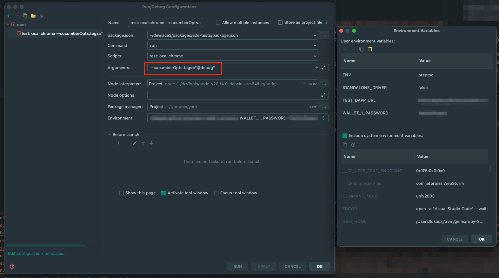
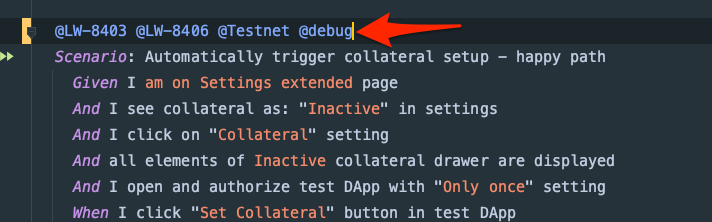
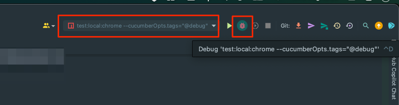

# Lace E2E-tests

UI-mapped gherkin tests for the Lace browser extension

## Prerequisites

- Java 8+ (optional if you already have webdriver running on port 4444)
  - it is only required when using
    with [selenium-standalone](https://github.com/webdriverio/selenium-standalone/blob/main/docs/java-versions.md)
  - On macOS, you can install it easily with homebrew: `brew install openjdk`
- gpg

## Running tests locally

- Set environment variable with wallet password that is used for test wallets and for decryption

  - `export WALLET_1_PASSWORD='<password>'`

- It is required to decrypt `walletConfiguration.ts.gpg` file that contains all the information about test wallets. (
  from the `packages/e2e-tests` directory)

  - `./decrypt_secret.sh`

- Install node dependencies (from the project root)

  - `yarn install`

- Build the extension (from the project root)

  - `yarn build`

- Run tests (from the `packages/e2e-tests` directory)
  - `yarn test:local:chrome`
  - `yarn test:local:edge`

## Selective gherkin scenario runs by tag matching

- `yarn wdio run wdio.conf.<browser>.ts --cucumberOpts.tags='@yourtag and @Testnet'`
- `yarn wdio run wdio.conf.<browser>.ts --cucumberOpts.tags='@yourtag or @otherTag and @Testnet'`
- `yarn wdio run wdio.conf.<browser>.ts --cucumberOpts.tags='@yourtag and not @Pending and @Testnet'`

## Supported browsers

- chrome
- edge

## Supported params

- `STANDALONE_DRIVER=true|false` default = false (optional)
  - true = use already running chromedriver on port 4444
  - false = use webdriver manager
- `ENV=(mainnet|preprod|preview)`default = preprod (optional)
  - determines default network used for tests
- `WALLET_1_PASSWORD=<password>`(required)
  - password for wallet, should match the password that is used in `walletConfiguration.ts` (can be set as an
    environment variable)
- `TEST_DAPP_URL=<url>`(required)
  - url for test DApp (only for DApp Connector tests)
- `SERVICE_WORKER_LOGS=true|false` default=false (optional)
  - enables service worker logs collection

## Run single feature file with params

- `ENV=preprod WALLET_1_PASSWORD='<password>' yarn wdio run wdio.conf.<browser>.ts --spec SendTransactionSimpleExtended.feature`

## Updating walletConfiguration.ts (for development)

- decrypt `walletConfiguration.ts.gpg` by running `./decrypt_secret.sh` (from the `packages/e2e-tests` directory)
- delete `packages/e2e-tests/src/support/walletConfiguration.ts.gpg`
- make necessary updates in `packages/e2e-tests/src/support/walletConfiguration.ts`
- encrypt `walletConfiguration.ts` by running `./encrypt_secret.sh` (from the `packages/e2e-tests` directory)
- delete `packages/e2e-tests/src/support/walletConfiguration.ts`

## Trezor test automation precondition (local run)

- run docker image locally <https://github.com/input-output-hk/lace-hw-testing-toolkit.git>
- After starting docker image (info should be displayed - `⚡️ Trezor Device Manipulation API is running at http://localhost:8000`)
  Tests need to be triggered in 60 sec because emulator shuts down device if there is no action  
  (will be improved in follow-up tickets by starting emulator trough API)

## Running tests locally in debug mode using IntelliJ IDEA/WebStorm

- create new run configuration
  - type: npm
- fill newly created configuration & environment variables as per attached screenshot
  - `example: STANDALONE_DRIVER=true;ENV=preprod;TEST_DAPP_URL=<yourUrl>;WALLET_1_PASSWORD=<walletPassword>`\
  
- make sure you have a chromedriver running on port 4444 (in case of STANDALONE_DRIVER=true)
- add "@debug" tag to the cucumber test that you want to debug\

- start debug run configuration you just created\

