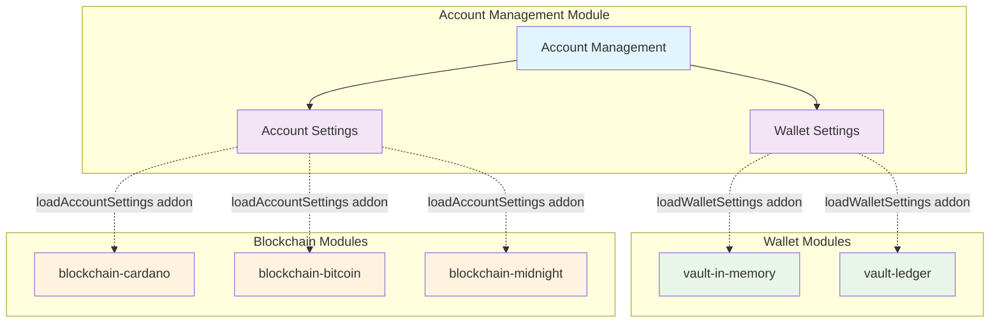
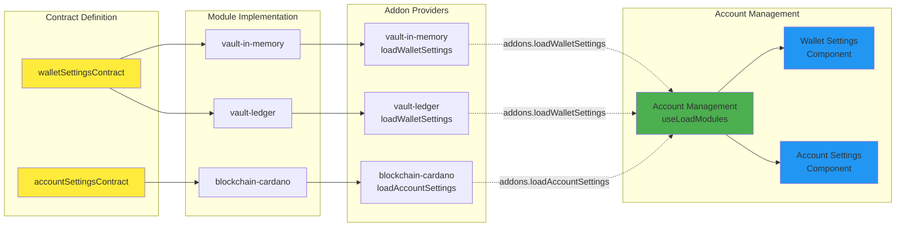

# Account Management Module

## Overview

The Account Management module centralizes account management functionality, providing pages and components for wallet and account administration across different blockchain types.

## Feature Flag Dependency

The module depends on:

- `FEATURE_FLAG_ACCOUNT_MANAGEMENT` - Controls the availability of all account management features

## Implemented Contracts

The module implements the following contracts:

- `@lace-contract/account-management` - Core account management contract
- `@lace-contract/module` - Base module infrastructure contract

## Exported Addons

The module exports the following addons for use by other modules:

### loadStackPages

Provides stack-based navigation pages for account management workflows.

### loadTabPages

Provides tab-based pages including:

- **accountCenter** - Main account overview tab page

### loadGlobalOverlays

Provides bottom sheet components for account management interactions.

## Core Pages

### AccountCenter (Tab Page)

The main account management page that centralizes:

- **Wallet List** - Display of available wallets
- **Associated Accounts** - Accounts linked to each wallet
- **Account Selection** - Interface for switching between accounts
- **Quick Actions** - Common account operations

This page serves as the central hub for account overview and management.

### AccountDetails (Stack Page)

The detailed account management page that provides:

- **Account Settings** - Configuration options for the selected account
- **Custom UI Components** - Blockchain-specific management interfaces
- **Account Information** - Comprehensive account details

## UI Customization

### AccountSettings Component

The AccountSettings component loads UI based on:

- **Own UI** - Default account management interface
- **Custom UI** - Blockchain-specific interfaces from UI modules

### Blockchain UI Module Integration

The module integrates with blockchain-specific UI modules such as:

- `@lace-module/blockchain-cardano-ui` - Provides Cardano-specific account management UI
- `@lace-module/blockchain-bitcoin-ui` - Provides Bitcoin-specific account management UI
- `@lace-module/blockchain-midnight` - Provides Midnight-specific account management UI
- Other blockchain UI modules as needed

These modules can provide custom components and interfaces that replace or extend the default account management UI.

## Module Scope

The Account Management module focuses on:

- Account and wallet listing and selection
- Account configuration and settings
- Integration points for blockchain-specific account features
- Navigation between account management interfaces
- Account customization options
- Key management interface
- Collateral management
- Account removal functionality

## Store

The module includes a Redux store slice with:

- Loading state management
- Actions for setting loading states
- Selectors for accessing account management state

## Usage

The module is automatically loaded when the `ACCOUNT_MANAGEMENT` feature flag is enabled. It integrates with the Lace mobile app's navigation system and provides account management functionality through the implemented contracts.

## Structure

```
src/
├── addons/
│   ├── stackPages.tsx    # Stack navigation pages
│   ├── tabPages.tsx      # Tab navigation pages
│   └── global-overlays.tsx  # Global overlay components
├── pages/
│   ├── accountCenter.tsx  # Main account management interface
│   ├── accountDetails.tsx # Account details and settings
│   └── index.tsx         # Page exports
├── store/
│   ├── index.ts          # Store configuration
│   ├── slice.ts          # Redux slice
│   └── init.ts           # Store initialization
├── constants.ts           # Feature flag constants
├── hooks.ts              # Custom hooks
└── index.ts              # Module entry point
```

## Development

To work with this module:

1. Ensure the `ACCOUNT_MANAGEMENT` feature flag is enabled
2. The module will automatically integrate with the navigation system
3. Use the provided hooks and selectors to access account management functionality
4. Extend the store slice for additional account management state as needed

# Account Management Architecture Diagrams

## 1. High-Level Architecture Overview



## 2. Contract and Addon Flow


