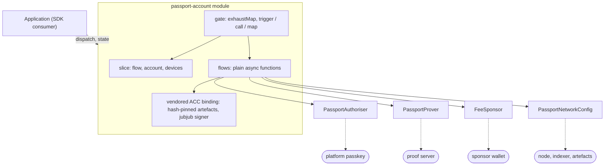
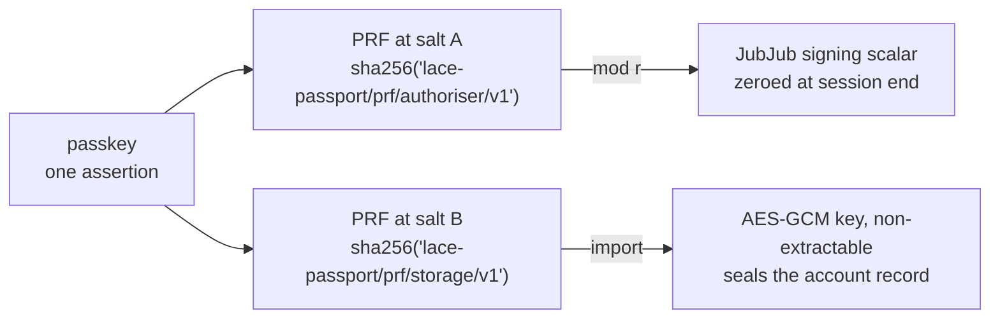
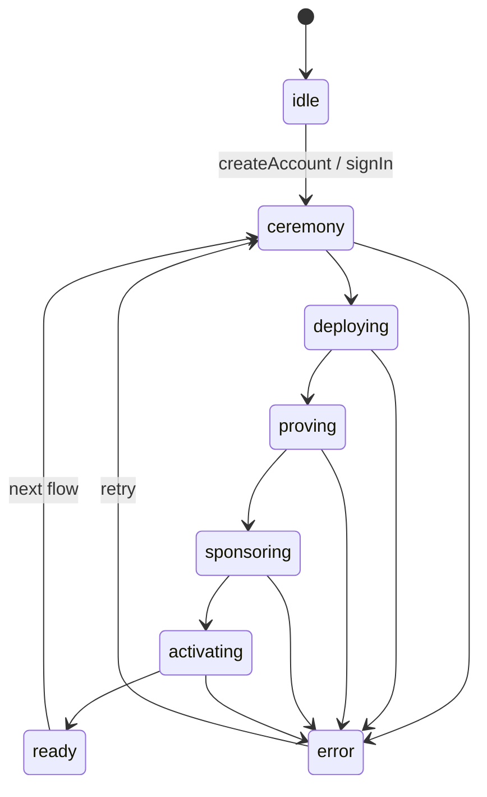
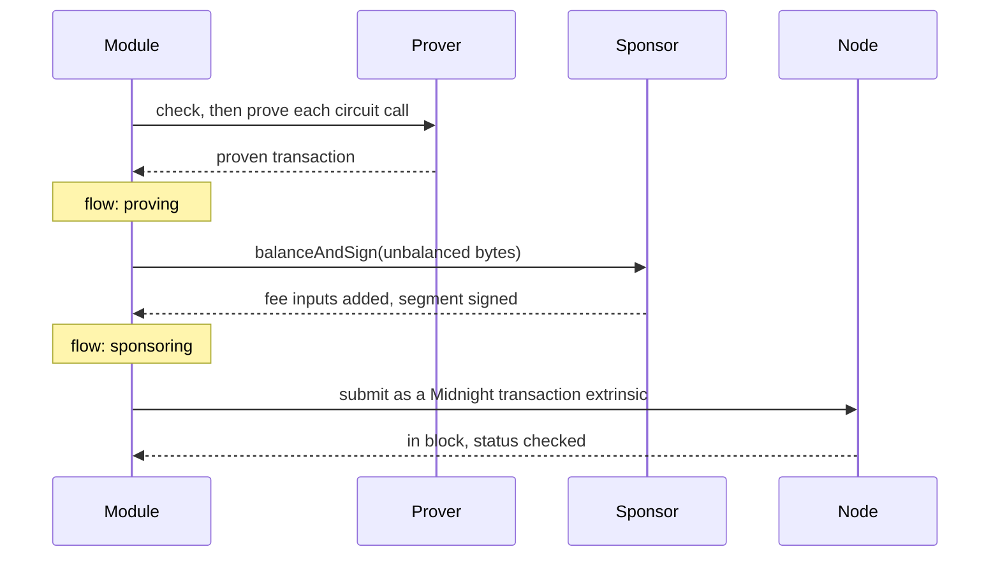
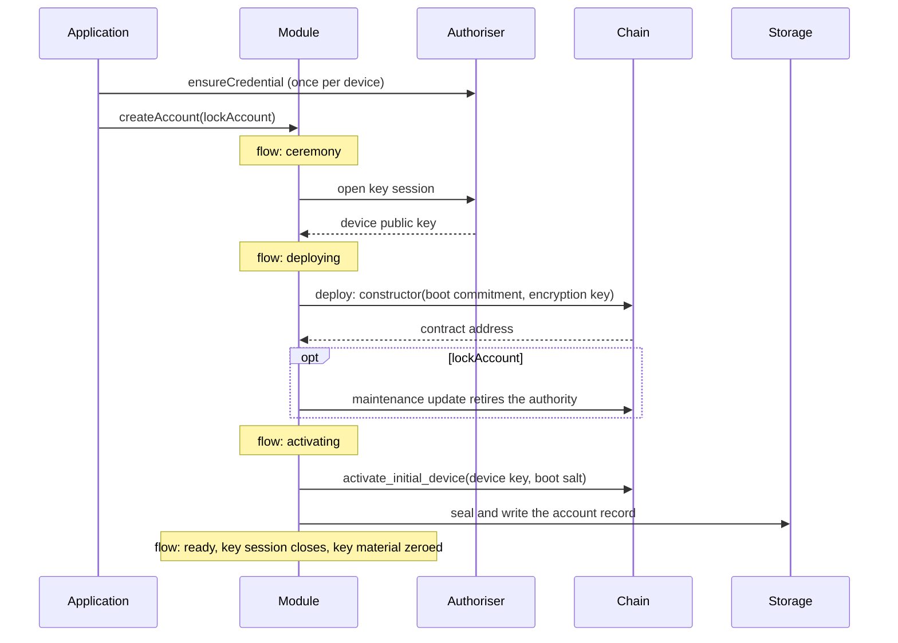
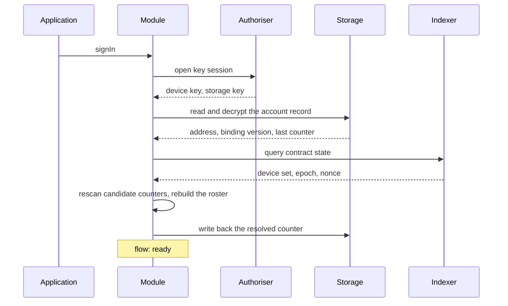
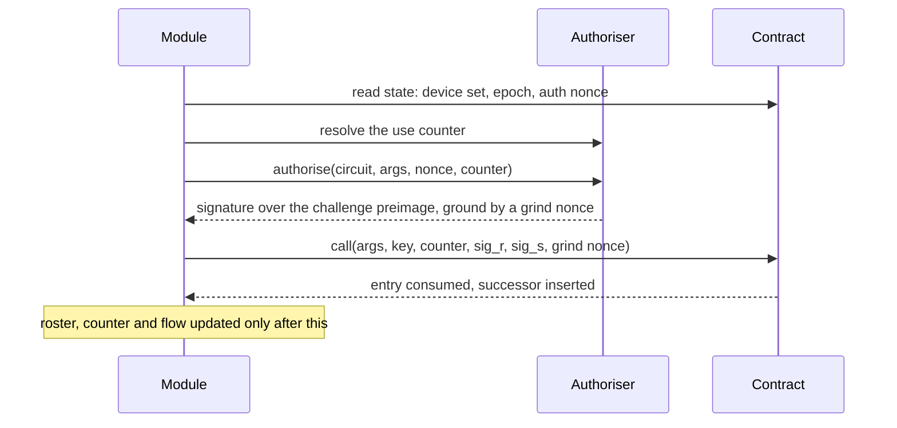

# @lace-module/passport-account

Passport smart accounts for Lace: an on-chain Midnight **Account Custody
Contract** (ACC) as the durable identity behind an account, standardised by
**MIP-0012** (contract custody of Midnight-native assets) and **MIP-0013**
(multi-key account authorisation). Device keys are held as revocable entries
on the contract rather than as the account's identity, so a device can be
enrolled or revoked without moving the account; the sole key source is a
platform passkey's WebAuthn **PRF** extension, which derives both the
device's signing scalar and the key that seals the persisted account record.
The account holds no funds of its own to pay fees: every transaction is
sponsored, so the user never needs Night or Dust to sign in, enrol a device,
or move assets.

Two properties follow from that shape and drive everything below. The user
holds no key material at rest, so there is no seed phrase and nothing to back
up. The user holds no tokens, so an account can be created and used with a
zero balance.

## Architecture

The module implements two contracts of the Lace module system:
`passport-store` (the `passport` slice and its side effects) and
`passport-dependency` (the platform capabilities the flows consume).
Four interfaces are supplied by the caller at construction, and everything
the module does against the network goes through one of them.



### Seams

The module is built around four small interfaces (`@lace-contract/passport`),
each swapped in by whatever the caller passes to
`createPassportAccountModule`:

| Interface               | First implementation (this package)                                                                                                               | Later replacement                                                                   |
| ----------------------- | ------------------------------------------------------------------------------------------------------------------------------------------------- | ----------------------------------------------------------------------------------- |
| `PassportAuthoriser`    | `createPasskeyAuthoriser` (WebAuthn PRF, production); `devJubjubAuthoriser` (in-memory key, internal to this package, used by its own tests only) | A curve-agnostic passkey arm once the reference contract ships one (see its README) |
| `FeeSponsor`            | `createDevSponsor` (funded localnet wallet pays every fee; local development only)                                                                | A hosted sponsor service, so no funded wallet is needed outside development         |
| `PassportProver`        | `createHttpProver` (HTTP proof server, wire-compatible with midnight-js)                                                                          | Same interface; a managed proof-server endpoint in production                       |
| `PassportNetworkConfig` | Plain network id plus indexer/node/artefact endpoints passed in by the caller                                                                     | Endpoint discovery/config owned by the consuming app                                |

### Flows and the gate

Account creation, sign-in, device enrolment and device revocation are each a
plain async function under `src/flows/`. Through `FlowContext` a host
supplies nothing but the four seams above, a promise-based account-record
seam, and an `onProgress` callback that a flow calls as it enters each stage
it reports; only account creation reports any, the other three settle with no
intermediate stage. Beyond that context, a flow drives the vendored binding
and the network clients itself. A flow never imports rxjs, redux,
`@reduxjs/toolkit`, redux-observable, `@lace-contract/module` or the store
layer, so it is platform neutral: it is what could move upstream unchanged if
the flow logic were ever needed outside this module.

The side effects that drive the slice run on observables, so they stay
marble-testable against a virtual scheduler. A flow's promise is turned into
an observable of its stages and its result exactly once, in the module's
`store/dependencies.ts`, and exposed to the side effects as `passportFlows`.
Nothing downstream of that wrapping ever touches a promise directly.

`passport-flows.ts` together with `flow-actions.ts` in
`src/store/side-effects/` turns each dispatched trigger into a flow start,
calls into `passportFlows`, and maps the resulting events onto slice actions.
The `exhaustMap` gate that makes the four flows mutually exclusive and the
settled-flow guard that decides whether a device call runs at all also live
there, because both are about coordinating dispatched actions rather than any
one flow's logic. The directory's other resident, `restore-account.ts`,
rehydrates the persisted record on startup.

### State and stored data

The slice holds the account, the device roster, the resolved use counter, and
one flow value with its error. The roster changes only after a chain call is
confirmed: `addDevice` and `removeDevice` are trigger actions that clear the
previous error and touch nothing else, so a failed call never leaves state
disagreeing with the contract.

| Location            | Contents                                                                                        | Lifetime                   |
| ------------------- | ----------------------------------------------------------------------------------------------- | -------------------------- |
| Contract (on chain) | Device entry set, device epoch, device count, auth nonce, encryption key, maintenance authority | Permanent                  |
| Slice (memory)      | `account`, `devices`, `localUseCounter`, `flow`, `flowError`                                    | Session                    |
| Account record      | `address`, `bindingVersion`, `localUseCounter`, sealed                                          | Across sessions            |
| Device signing key  | JubJub scalar derived from the passkey                                                          | One operation, then zeroed |

The account record is sealed with AES-GCM under a key derived in the same
ceremony as the signing key. The stored value is `{ v: 1, iv, ciphertext }`
with a fresh 12-byte IV per write, so nothing about the account is readable at
rest, and a record that fails to decrypt is reported as corrupt rather than
treated as absent.

### Key material

One passkey assertion yields both keys the module needs. The PRF extension is
evaluated at two salts in the same ceremony, each the SHA-256 of a fixed
label, so the two keys are domain separated and neither can be derived from
the other. The passkey itself never leaves the platform authenticator; only
PRF outputs cross the boundary.



A flow calls the authoriser several times: for the public key, for entry
commitments, and for the call signature. Each call on its own would mean one
user prompt, so the authoriser offers a key session: the ceremony runs once at
the open and every nested call reuses the derived key. The session counts the
flows holding it and closes on the last one out, because a flow that joined an
open session would otherwise lose its key mid-operation if the opener settled
first. This is the only caching of signing material.

| Flow                                      | Ceremonies                               |
| ----------------------------------------- | ---------------------------------------- |
| Create account, first account on a device | 2 (one creates the passkey, one uses it) |
| Create account, passkey already enrolled  | 1                                        |
| Sign in                                   | 1                                        |
| Add device, remove device                 | 1 each                                   |

Passkey creation returns no PRF output, so the first account on a device
cannot be reduced below two.

### One gate over all four flows

Account creation, sign-in, device enrolment and device revocation run through
a single `exhaustMap` rather than one each. They are mutually exclusive: every
one of them resolves the same device's use counter and writes the same account
record, so two in flight can authorise against the same counter and auth
nonce, leaving one transaction to consume the entry and the other to fail with
the local roster disagreeing with chain. A dispatch that arrives while another
flow is running is dropped, the same silence `exhaustMap` already gives a
repeated dispatch of one action.

The gate cannot be built on the flow value. State reaches a side effect before
the action does, and a running flow is still subscribed while its own terminal
`setFlow('ready')` is being delivered, so a guard reading the flow back cannot
tell a request the gate will accept from one it will drop. Exclusion is
therefore structural.

Because only the gate knows which requests it accepted, it also owns the entry
into `ceremony`. The four trigger actions are pure: they carry the request and
change nothing. A dropped request leaves the running flow's state untouched,
and an accepted one enters `ceremony` synchronously, within the same dispatch
cycle as the trigger.

### Flow states

One value reports progress for every flow. Each path settles: a success ends
at `ready` and clears the previous error, a failure ends at `error` carrying a
typed code. A device call may start from `error`, so a retry does not need a
fresh sign-in ceremony, which is why a device success has to move the flow
back rather than leave it where it was.



`proving` and `sponsoring` are reported from inside the transaction pipeline,
so they recur for each transaction a flow submits.

Every accepted trigger enters `ceremony`, device calls included, because the
gate enters it before the flow's own guards run. A device call the gate
accepts but the settled-flow guard refuses to call, because no account is in
state or the current flow has not settled, therefore passes through
`ceremony` before settling on `error` with `no-account`; it opens no key
session and touches no chain state on the way.

| Condition                                                 | Reported as                |
| --------------------------------------------------------- | -------------------------- |
| User dismissed the passkey prompt                         | `ceremony-cancelled`       |
| Authenticator has no PRF support                          | `prf-unsupported`          |
| Downloaded artefact does not match its pin                | `artefact-integrity`       |
| Sponsor could not cover the fee within its budget         | `sponsor-exhausted`        |
| Create dispatched while a record already exists           | `account-exists`           |
| No account record stored on this device                   | `account-not-found`        |
| No live contract at the stored address                    | `account-contract-missing` |
| Sealed record found but the authoriser has no storage key | `record-unreadable`        |
| Stored record will not decrypt                            | `record-corrupted`         |
| Contract rejected the caller (signature or device key)    | `not-authorised`           |
| No device entry within the probed counter windows         | `device-entry-not-found`   |
| Removal target entry no longer in the on-chain set        | `removal-target-not-found` |
| Removal would leave no device, or removes the caller      | `last-device`              |
| Device flow attempted without a ready account             | `no-account`               |

## Flows

### Transaction pipeline

Every chain write follows the same three steps. The module never holds funds,
so proving and payment are separate concerns joined here. A submission whose
finalized status reports failure rejects, so no local state advances for a
call the contract did not accept, and a rejection caused by a stale dust view
is retried while any other rejection fails the flow.



### Account creation

The contract cannot know its own address while its constructor runs, so
creation is two transactions: the constructor stores a salted boot commitment
over the device public key, and a second, permissionless call presents the key
and salt to install the first device entry. A third transaction is added when
the account is locked.



Each chain step is the pipeline above, so the proving and sponsoring stages
repeat per transaction.

#### Deployed circuits

The compiled contract carries two authorisation arms, jubjub and an interim
ECDSA stand-in. This module installs verifier keys for the jubjub arm and the
two permissionless deposit circuits only, so on an account created here only
jubjub devices can ever authorise. Assembling the initial state requires the
verifier key of every impure circuit, and each downloaded artefact is checked
against a sha256 pin held in the module; a key location whose pin disagrees
with the chain's expected verifier key fails before the proof server is
contacted.

#### The lock choice

`lockAccount` is a required parameter of account creation with no default,
because it is a one-way decision about who can move the account's assets.

| Value   | Effect                                                                                                                                                  | Cost                                                                                                       |
| ------- | ------------------------------------------------------------------------------------------------------------------------------------------------------- | ---------------------------------------------------------------------------------------------------------- |
| `true`  | The maintenance authority is replaced with an unsatisfiable one, so no maintenance update can be signed again and the device set is the only way to act | The account can never receive a future arm's circuits; migration to a new account is the only upgrade path |
| `false` | The deploy-time authority stays live, so verifier keys can be replaced later                                                                            | Whoever holds that authority can swap verifier keys and move the assets, independently of the device set   |

### Recognition on return

Recognition is a user-initiated flow, not a startup step: the account record
is sealed under a key only a ceremony can produce, so nothing can be read
without a user gesture. A missing record ends the flow with
`account-not-found`, a record whose address holds no live contract with
`account-contract-missing`, and a sealed record the configured authoriser
cannot open with `record-unreadable`; there is no discovery by any other
means.



The roster is rebuilt from the contract rather than from the record. The entry
set is enumerable, so sign-in reads every live entry and flags the one whose
commitment matches this device; the rest are other devices, identified only by
their commitment. A device enrolled elsewhere therefore survives a reload.

#### Use counters

A device entry is single use. Each gated call consumes the entry matching
`hash(address, key, epoch, counter)` and inserts its successor, so the counter
advances by one per call. A device used elsewhere, which happens whenever a
passkey is synced across a user's devices, leaves the stored counter behind,
so sign-in treats the stored value as a starting point and scans forward
within a window of 4096 candidates, then writes the resolved counter back so
the next sign-in starts from a fresh anchor. Commitments are computed in
chunks, so the scan costs one ceremony per chunk rather than one per
candidate.

If the upward window finds nothing, the scan continues below the anchor. A
device that was removed and re-enrolled sits at a low counter while the
persisted anchor is still high, and searching only upward would report a live
device as unauthorised.

### Device management

Adding and removing devices are gated calls: the contract accepts them only
with a signature from a live device entry. The new device's entry commitment
is supplied by the caller, so a device can be enrolled without its private key
ever being present.



Both flows require an account in state and a settled flow, and refuse to touch
the chain otherwise. Contract guards surface as typed errors: removing the
authorising device or the last remaining device is rejected, as is a signature
from a revoked or unknown entry.

## Factory API

`createPassportAccountModule` builds the module from four platform-supplied
seams and implements both `passport-store` and `passport-dependency`
(`@lace-contract/passport`), so it can be passed straight to
`createLaceWallet({ modules: [...] })`.

```typescript
import { createLaceWallet, m } from '@input-output-hk/lace-sdk';

const authoriser = m.createPasskeyAuthoriser({ rpName: 'Lace' });
await authoriser.ensureCredential(); // one-time enrolment; see below

const wallet = await createLaceWallet({
  modules: [
    m.createPassportAccountModule({
      authoriser,
      sponsor: m.createDevSponsor({
        seedHex: process.env.WALLET_SEED!,
        networkId: 'undeployed',
        indexerUrl: 'http://localhost:8088/api/v4/graphql',
        indexerWsUrl: 'ws://localhost:8088/api/v4/graphql/ws',
        nodeUrl: 'http://localhost:9944',
        proofServerUrl: 'http://127.0.0.1:6300',
      }),
      prover: m.createHttpProver('http://127.0.0.1:6300', {
        artefactUrl: 'https://artefacts.example.com/account',
      }),
      network: {
        networkId: 'undeployed',
        indexerUrl: 'http://localhost:8088/api/v4/graphql',
        indexerWsUrl: 'ws://localhost:8088/api/v4/graphql/ws',
        nodeUrl: 'http://localhost:9944',
        artefactUrl: 'https://artefacts.example.com/account',
      },
    }),
  ] as const,
  environment: 'development',
  config: {
    /* see @input-output-hk/lace-sdk's README */
  },
});
```

`networkId` names the Midnight network for the Midnight libraries themselves
(address formats and transaction binding depend on it, and every wallet or
contract operation throws until it is set). The module applies it on the way
into each chain flow, so a consumer never calls `setNetworkId` itself; the
sponsor takes its own copy because it starts its wallet before any provider
exists.

`createDevSponsor` above is a development seam: it pays fees from a funded
localnet wallet and is only ever appropriate for local development.
Production wiring supplies its own `FeeSponsor` (see the seam table).

`ensureCredential` must run exactly once per device, before its first
`createAccount` call: it creates the resident passkey via
`navigator.credentials.create`, and without it a brand-new device has no
credential for the ceremony's `credentials.get` to discover. Do not call it
on return visits: it is a no-op only within the same authoriser instance (the
credential id lives in memory, not in storage), so a fresh instance would
mint a second passkey. Returning sessions dispatch `signIn` instead, whose
ceremony discovers the existing resident passkey through `credentials.get`.

### Proof server URL

Pass an origin with no path prefix (`http://127.0.0.1:6300`, not
`https://gateway.example.com/proof-server`).
`@midnightntwrk/wallet-sdk-prover-client`, which the fee sponsor proves
through, builds its endpoint as `new URL('/prove', baseUrl)`, and an absolute
path discards any prefix on the base URL: a prefixed URL silently posts to the
wrong place and proving fails with "Failed to prove transaction".
`createHttpProver` in this package concatenates instead and so tolerates a
prefix, but the sponsor's prover does not, so both take an origin.

## Constraints

- **No recovery path.** The vendored contract's constructor takes a device
  boot commitment and an encryption key, and no recovery commitment, so if
  every device holding the passkey is lost the account cannot be recovered.
  Recovery (the MIP recovery commitment / BUSS path) depends on a later
  contract version.
- **One authorisation arm.** Only jubjub verifier keys are installed. A
  passkey-native arm requires a new contract build, and on a locked account a
  new account.
- **Enrolment is bound to a platform authenticator.** The passkey is created
  on the device in use and syncs through the platform credential manager.
  Cross-device enrolment by QR is not part of this design.
- **The fee sponsor is a development implementation.** Production requires a
  sponsor service behind the same interface.
- **Chain wallets are out of scope.** Deriving Cardano or Bitcoin accounts
  from a Passport identity is a later phase; this module covers the account
  identity and its device set.
- **Toolchain is pre-release.** The compiled contract and the Midnight
  libraries are pinned as one mutually compatible set, and changing any one of
  them independently is expected to break proving or deployment.
- **The flow layer cannot depend on rxjs, redux or this module's store.**
  `src/flows/` imports no rxjs, no redux, `@reduxjs/toolkit` or
  redux-observable, no `@lace-contract/module`, and nothing from the store
  layer, so it stays platform neutral; the boundary is enforced by ESLint
  rather than left to convention.

## Pinned Midnight versions

This module vendors a compiled Account Custody Contract (`src/acc/generated`)
built against one exact toolchain and dependency set. Only this set is
mutually compatible; bumping any one of these independently has been
observed upstream to break proving, verification, or deployment (see the
reference implementation's README for the specific failure modes).

| Package                                                    | Version        |
| ---------------------------------------------------------- | -------------- |
| `@midnight-ntwrk/compact-js`                               | `2.5.5-rc.6`   |
| `@midnight-ntwrk/compact-runtime`                          | `0.18.0-rc.1`  |
| `@midnight-ntwrk/midnight-js-contracts`                    | `5.0.0-beta.4` |
| `@midnight-ntwrk/midnight-js-http-client-proof-provider`   | `5.0.0-beta.4` |
| `@midnight-ntwrk/midnight-js-indexer-public-data-provider` | `5.0.0-beta.4` |
| `@midnight-ntwrk/midnight-js-network-id`                   | `5.0.0-beta.4` |
| `@midnight-ntwrk/midnight-js-protocol`                     | `5.0.0-beta.4` |
| `@midnight-ntwrk/midnight-js-types`                        | `5.0.0-beta.4` |
| `@midnightntwrk/ledger-v9`                                 | `1.0.0-rc.3`   |
| `@midnightntwrk/wallet-sdk-capabilities`                   | `4.0.0-beta.2` |
| `@midnightntwrk/wallet-sdk-dust-wallet`                    | `5.0.0-beta.2` |
| `@midnightntwrk/wallet-sdk-facade`                         | `5.0.0-beta.2` |
| `@midnightntwrk/wallet-sdk-hd`                             | `3.1.0-beta.1` |
| `@midnightntwrk/wallet-sdk-shielded`                       | `4.0.0-beta.2` |
| `@midnightntwrk/wallet-sdk-unshielded-wallet`              | `4.0.0-beta.2` |
| `@noble/curves`                                            | `2.2.0`        |
| `@polkadot/api`                                            | `16.5.6`       |

`@polkadot/api` is the substrate RPC client behind the node relay submitter
(`src/infra/node-relay.ts`), which submits each finalized transaction as a
`midnight.sendMnTransaction` extrinsic and resolves once it is in a block.

The compiled artefact's own toolchain pins (`compactc`, the Compact language,
and `compact-runtime`) live in `accManifest.toolchain`
(`src/acc/manifest.ts`), alongside the sha256 digest of every circuit's IR,
prover key, and verifier key.

## Root dependency overrides

The repository root `package.json` `overrides` pin
`@midnight-ntwrk/midnight-js-types` and
`@midnight-ntwrk/midnight-js-http-client-proof-provider` for the legacy
Midnight stack, with the override keys scoped to `@4.x` so this package's
`5.0.0-beta.4` pins survive a clean install (after `npm ci` the package
resolves its own nested `5.0.0-beta.4` copies).

Those pins are deliberately scoped rather than workspace-wide. The two
Midnight lines are not interchangeable: `compact-js` 2.5.x pulls
`ledger-v8`, and the 2.5.5-rc line this package needs pulls `ledger-v9`.
Forcing one version on the whole workspace moves every other consumer
onto the other line, which changes what the extension host's vendored
bundle inlines and puts a second wasm runtime in the extension's bundler
path. This package keeps its own nested copies instead.

## Resolving one copy per package in a consumer

A consumer application resolves the Midnight packages itself, because the
SDK marks them external. It must end up with exactly ONE physical copy of
each: two copies mean two wasm instances, whose classes reject each
other's objects, and a contract deployment fails with an error of the form
`expected instance of ContractMaintenanceAuthority`. With a bundler that
deduplicates by configuration, list the Midnight packages explicitly (for
Vite, `resolve.dedupe`); the packages that matter are `compact-js`,
`compact-runtime`, `midnight-js-contracts`, `midnight-js-network-id`,
`midnight-js-protocol`, `midnight-js-types`, `ledger-v9`, and
`onchain-runtime-v4`. The network id and the wasm class registries are
module-global state, so a duplicated copy also means a second, unset
network id.

## Running unit tests

```sh
npx nx test @lace-module/passport-account
```

Unit tests mock every Midnight package and the network; they cover every seam
in isolation and every layer of the flow. `test/flows/` exercises each flow
as a plain async function, with no scheduler, against a mocked `FlowContext`.
`test/store/side-effects/` drives the gate as marble tests over a mocked
`passportFlows`, including the `runPassportFlow: the gate` describe block in
`passport-flows.test.ts`, dedicated to the cross-flow exclusivity the gate
enforces. `test/store/side-effects/passport-flows.test.ts` additionally
runs the real flows through `createDependencies` over mocked infrastructure,
so the terminal state a consumer would observe is asserted rather than the
sequence of actions alone.
